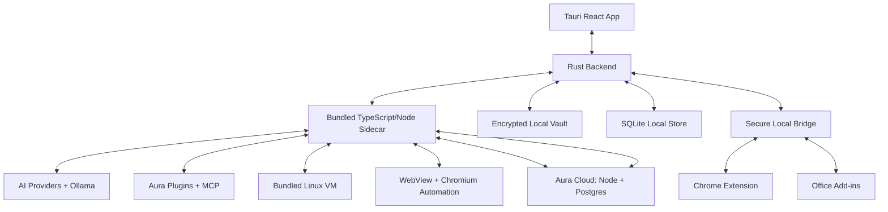

# Aura OS PRD + Technical Specification

Version: 1.1  
Audience: General coding agent or engineering team  
Primary user: Individual developer  
License target: Apache-2.0  
Platforms: macOS, Windows, Linux  
Build process: Phased execution with mandatory human approval gates (Section 0)  
UI design source: Aura OS Design System (Section 8), mandatory  
Release target: Public open-source community release under Apache-2.0 (Section 10)

---

## Arabic Executive Summary

Aura OS هو تطبيق سطح مكتب مفتوح المصدر يشبه Claude Cowork من حيث الفكرة العامة: وكيل ذكاء اصطناعي يعمل على جهاز المستخدم، يقرأ الملفات التي يختارها المستخدم، ينفذ مهام طويلة، يشغل أوامر وكود داخل بيئة معزولة، يستخدم المتصفح، يتعامل مع إضافات، وينتج مخرجات مباشرة داخل ملفات المستخدم.

الاختلاف الأساسي أن Aura OS يكون متعدد المزودين، مفتوح المصدر، قابل للاستضافة الذاتية، ويدعم مفاتيح API الخاصة بالمستخدم بدون أن تغادر الجهاز. التطبيق يدعم OpenAI وAnthropic وGemini وDeepSeek وOllama وأي API متوافق مع OpenAI، مع راوتر نماذج يختار النموذج الأفضل للجودة أولًا ويعرض التكلفة والـ tokens للشفافية فقط.

Aura OS يتكون من تطبيق Tauri بواجهة React، نواة Rust، وsidecar مدمج بـ TypeScript/Node. تنفيذ الكود وأوامر Shell يبدأ من v1 داخل Linux VM مدمجة مع المثبت، باستخدام Apple Virtualization على macOS، Hyper-V على Windows، وKVM/QEMU على Linux. يملك التطبيق نظام صلاحيات دقيق لكل مشروع، وضع Ask-first افتراضيًا، ووضع Act without asking اختياريًا للمشاريع الموثوقة. الحذف الدائم والأفعال عالية التأثير تحتاج موافقة صريحة دائمًا.

Aura Cloud جزء من v1 لتوفير remote dispatch والمزامنة، لكنه يستخدم تشفيرًا طرفيًا E2EE. الخادم لا يستطيع قراءة محتوى المهام أو السجلات أو الإعدادات المتزامنة. مفاتيح API لا تتم مزامنتها أبدًا وتبقى مشفرة محليًا على كل جهاز. Aura Cloud يجب أن يكون متوفرًا كخدمة رسمية اختيارية ومدفوعة لاحقًا، مع خادم مفتوح المصدر قابل للاستضافة الذاتية.

الوثيقة تحدد الأسطح الوظيفية (مثل المشاريع، المهام، الموافقات، السجل، الإعدادات، Monaco editor، Git diff/status/commit approval، Scheduled tasks، الإضافات، Chrome extension، Office add-ins، وcomputer use التجريبي)، وتتضمّن أيضًا نظام تصميم بصري إلزاميًا باسم Aura OS Design System (القسم 8) يجب على واجهة المستخدم الالتزام به بالكامل في كل سطح من هذه الأسطح.

تُبنى Aura OS على مراحل مرتّبة مع بوابات موافقة بشرية: ينفّذ الوكيل مرحلة واحدة فقط، ثم يتوقّف ويقدّم تقريرًا كاملًا بالعربية عمّا أنجزه وكيفية التحقق منه، ولا ينتقل إلى المرحلة التالية إلا بعد إذن صريح من المستخدم (القسم 0). وجوهر المنتج وكيلٌ يعمل في حلقة تشغيل مستمرة (agent loop) لإنجاز المهام الطويلة خطوة بخطوة مع بقائه قابلًا للمراقبة والإيقاف والتوجيه وتحت ضبط الصلاحيات (القسم 2.21).

---

## 0. Agent Execution Protocol (Mandatory Build Process)

This section governs HOW the building agent must construct Aura OS. It is mandatory and takes precedence over any default tendency to build large parts of the system at once. The agent must read this section in full before starting Phase 1, and must follow it for the entire project until Phase 14 is approved.

### 0.1 Core Operating Rule: One Phase At A Time With Human Approval Gates

The implementation is divided into ordered Phases. The agent must build EXACTLY ONE phase at a time, in order, and must never begin the next phase before the user explicitly approves the current one.

Hard rules:

- Work on a single active phase only. Do not start, scaffold, stub, or "prepare" later phases ahead of time.
- Do not skip, merge, reorder, shortcut, or parallelize phases unless the user explicitly instructs otherwise.
- When the active phase is finished, STOP and deliver a Phase Completion Report (Section 0.3), then WAIT for the user.
- Resume only after the user gives an explicit approval keyword (Section 0.4).
- If the user requests changes, apply them inside the current phase and re-submit an updated report. Do not advance to the next phase.
- If the agent becomes blocked (missing permission, missing input, failing dependency, ambiguous requirement), STOP and report the blocker instead of guessing or silently working around a gated requirement.
- Never claim a phase is complete unless it builds, runs, and passes its acceptance criteria.

### 0.2 Canonical Phase Order

Each phase maps to a milestone in Section 4 and/or a dedicated section. The Aura OS Design System (Section 8) is a cross-cutting, mandatory requirement: every phase that renders any user interface must comply with it, beginning with Phase 1.

1. Phase 1 — Repository, Desktop Shell, and Design System Foundation (Section 4 · Milestone 1 + Section 8 foundation).
2. Phase 2 — Vault, Providers, Routing, and Cost Display (Section 4 · Milestone 2).
3. Phase 3 — Task Engine and Tool Runtime (Section 4 · Milestone 3).
4. Phase 4 — VM Execution (Section 4 · Milestone 4).
5. Phase 5 — Browser and Web (Section 4 · Milestone 5).
6. Phase 6 — Plugins and MCP (Section 4 · Milestone 6).
7. Phase 7 — Aura Cloud and E2EE Sync (Section 4 · Milestone 7).
8. Phase 8 — Scheduled Tasks (Section 4 · Milestone 8).
9. Phase 9 — Chrome Extension and Office Add-ins (Section 4 · Milestone 9).
10. Phase 10 — Computer Use (Section 4 · Milestone 10).
11. Phase 11 — Packaging, Updates, and Localization (Section 4 · Milestone 11).
12. Phase 12 — Full Integration QA and "Application Complete" Verification: run the entire Acceptance Test Suite (Section 5) end to end and confirm the application is feature-complete and working on macOS, Windows, and Linux.
13. Phase 13 — Marketing and Download Website (Section 4 · Milestone 12, detailed in Section 9). Started only after Phase 12 is approved.
14. Phase 14 — Open-Source Release and Community Launch (Section 4 · Milestone 13, detailed in Section 10), including the project license.

The project is considered DONE only after Phase 14 is delivered and approved.

### 0.3 Phase Completion Report (required at every gate)

When a phase is complete, the agent must post a single, structured Phase Completion Report. The report MUST be written in Arabic (the user's language), MUST be clear enough for a non-expert to verify the result, and MUST contain the following, in this order:

1. العنوان: «✅ الخطوة رقم N اكتملت: <اسم المرحلة>».
2. ملخّص تنفيذي: من سطرين إلى أربعة أسطر تشرح ماذا أُنجز في هذه المرحلة.
3. ما الذي تم بناؤه فعليًا: قائمة دقيقة بالمكوّنات والوحدات والملفات الأساسية التي أُنشئت أو عُدِّلت.
4. كيف تختبرها بنفسك: خطوات عملية واضحة يقدر المستخدم يتبعها ليتأكد أن المرحلة تعمل (أوامر، شاشات، نتائج متوقّعة).
5. نتائج الفحوصات الآلية: أوامر البناء/الاختبار التي شُغّلت ونتيجتها (نجاح/فشل)، مع أي تغطية اختبارية إن وُجدت.
6. الالتزام بنظام التصميم: تأكيد أن كل واجهة في هذه المرحلة تتبع Aura OS Design System (القسم 8)، أو توضيح أن هذه المرحلة لا تتضمّن واجهة.
7. المشاكل والمخاطر والديون التقنية: أي شيء غير مكتمل أو يحتاج انتباهًا لاحقًا.
8. القرارات والافتراضات: أهم الخيارات التقنية التي اتُّخذت وسببها.
9. المرحلة التالية: رقم واسم المرحلة القادمة ونبذة قصيرة عمّا ستشمله.
10. طلب الإذن (آخر سطر دائمًا): «هل أنتقل إلى الخطوة رقم N+1؟ في انتظار إذنك الصريح.»

The approval request must always be the final line and must never be buried in the middle of the report.

### 0.4 Approval and Control Keywords

The agent advances to the next phase only after an explicit approval from the user, such as:

- «موافق»، «كمل»، «التالي»، «ابدأ المرحلة التالية»، «تمام كمل»، or in English "approve", "next", "continue", "go ahead".

Other control signals the agent must honor:

- «عدّل: …» / "change: …" → revise the current phase as requested, then re-submit the report. Do not advance.
- «وقف» / "stop" / "pause" → halt work and wait for instructions.
- «ارجع للمرحلة N» / "go back to phase N" → return to a previous phase and re-open it.

Silence, generic praise ("nice", «حلو»), or an unrelated question is NOT approval. When the intent is unclear, the agent must ask for explicit confirmation before proceeding.

### 0.5 Relationship To The Product's Own Agent Loop

This protocol controls the build process for the engineering agent. It is distinct from the runtime autonomous agent loop that Aura OS itself ships to its end users, specified in Section 2.21. Both are built on an observe → plan → act → verify → report cycle, but the build process always pauses at a human approval gate between phases, whereas the shipped product loop runs autonomously within the permissions the user grants.

> ملاحظة للمستخدم (بالعربي): الوكيل راح يبني المشروع مرحلة مرحلة. بعد كل مرحلة يوقف ويعطيك تقريرًا كاملًا بالعربي عن اللي سوّاه وكيف تتأكد إنه شغّال، وما ينتقل للمرحلة اللي بعدها إلا لما تكتب له إذنًا صريحًا مثل «موافق» أو «كمل». وأهم خاصية في التطبيق نفسه أن الوكيل يشتغل في حلقة مستمرة (loop) لإنجاز المهام الطويلة خطوة بخطوة.

---

## 1. Product Definition

### 1.1 Product Vision

Aura OS is an open-source desktop agent platform that lets an individual developer delegate complex, long-running computer work to AI while keeping local files, API keys, execution, permissions, and auditability under the user's control.

Aura OS should feel like an open-source, multi-provider, self-hostable alternative to Claude Cowork:

- It runs on the user's computer.
- It works with connected local folders, external files, browser context, Office files, plugins, MCP tools, and selected desktop apps.
- It can plan, break work into subtasks, coordinate sub-agents, run code, execute shell commands, create deliverables, and report progress.
- It supports remote task dispatch through Aura Cloud without exposing plaintext task content to Aura Cloud.
- It supports local-only operation through Ollama for users who do not want cloud AI providers.

### 1.2 Primary User

The primary user is an individual developer who wants a powerful agentic work environment for:

- Coding tasks.
- Project analysis.
- File and document automation.
- Research and synthesis.
- Data processing.
- Scheduled recurring work.
- Cross-tool workflows involving files, browser pages, MCP tools, plugins, and selected desktop applications.

Team and enterprise controls are not the target for v1, except where the architecture should avoid blocking future support.

### 1.3 Goals

Aura OS v1 must:

1. Provide a desktop app for macOS, Windows, and Linux.
2. Use Tauri + React for the app shell, Rust for native/backend capabilities, and a bundled TypeScript/Node sidecar for agent orchestration and integrations.
3. Support multiple AI providers: OpenAI, Anthropic, Gemini, DeepSeek, Ollama, and OpenAI-compatible endpoints.
4. Route model usage quality-first with configurable policies.
5. Display token and cost estimates using auto-updated model pricing, without enforcing a budget cap.
6. Store API keys only on the user's local device in an encrypted file unlocked by a device-derived key.
7. Execute code and shell commands inside a local Linux VM from v1.
8. Support local projects with instructions, context, files, history, memory, scheduled tasks, permissions, and audit logs.
9. Support long-running tasks, pause/resume, cancellation, visible progress, and user steering.
10. Support sub-agent coordination with fixed intelligent roles.
11. Support scheduled tasks with pre-approved permission profiles.
12. Support remote dispatch and E2EE sync through Aura Cloud.
13. Support Aura plugins and MCP.
14. Support Chrome extension v1 and Office add-ins v1.
15. Support experimental computer use with per-app permissions.
16. Provide Monaco editor, Git status/diff, and Git commits with explicit approval.
17. Provide 20 initial UI languages and a community translation workflow.
18. Implement the user interface strictly according to the Aura OS Design System (Section 8); functional UI requirements are specified throughout, and visual design is governed by that system.
19. Execute the entire build as an ordered, phase-by-phase process with mandatory human approval gates between phases (Section 0).
20. Ship an autonomous agent loop as the core runtime behavior for executing long, multi-step tasks (Section 2.21).
21. Ship a public marketing and download website after the application is complete and verified (Section 9).
22. Release the project to the open-source community under Apache-2.0 with full license, notices, and governance files (Section 10).

### 1.4 Non-Goals

Aura OS v1 must not:

- Provide enterprise MDM controls.
- Provide centralized plaintext cloud processing of user tasks.
- Sync API keys through Aura Cloud.
- Require a single AI provider.
- Require internet access when the user wants local-only Ollama workflows.
- Let scheduled tasks permanently delete files or perform high-impact external actions without explicit approval.
- Ship user-customizable theming or alternative visual styles beyond the Aura OS Design System's defined light and dark themes (Section 8) in v1.

### 1.5 Product Principles

- User-owned execution: local files, local VM, local key vault, and local permissions are first-class.
- E2EE cloud: Aura Cloud may relay and sync data, but must not read task content.
- Multi-provider by design: no provider lock-in.
- Transparency over silent autonomy: the user can see plans, actions, tool calls, outputs, approvals, and audit logs.
- Powerful but gated: risky operations require permission even in autonomous modes.
- Open extension model: plugins and MCP expand the system while remaining permissioned and auditable.

---

## 2. Functional Requirements

### 2.1 Projects

Aura OS must organize work into local projects.

A project includes:

- Name.
- Connected primary folder.
- Optional external files.
- Project instructions.
- Project permission profile.
- Project memory.
- Task history.
- Scheduled tasks.
- Browser profile.
- VM workspace mapping.
- Audit log.
- Plugin settings.
- Git status if the connected folder is a Git repository.

Project creation must support:

- Create from an existing folder.
- Create from scratch with a new folder.
- Add external files after creation.
- Add project instructions after creation.

External file policy:

- External files may be read and written only with explicit permission.
- External write access must be surfaced as a distinct permission because the file is outside the primary project folder.
- The audit log must record every external file read/write request and outcome.

### 2.2 Task Model

Aura OS tasks are long-running agent sessions attached to a project.

Each task must support:

- User prompt/instructions.
- Agent-generated plan.
- User review of plan before execution in Ask-first mode.
- Step-by-step progress.
- Subtasks and sub-agent workstreams.
- Tool calls and outputs.
- Pause.
- Resume.
- Cancel.
- Retry failed step where practical.
- User steering mid-task.
- Final summary.
- Created/modified files list.
- Git diff summary when project is a Git repository.
- Token and cost estimate summary.
- Audit entries for sensitive actions.

Task states:

- Draft.
- Planning.
- Waiting for approval.
- Running.
- Paused.
- Blocked.
- Completed.
- Failed.
- Cancelled.

Task execution rules:

- Ask-first is the default autonomy mode.
- Act without asking is optional per trusted project/session.
- Even in Act without asking mode, deletion, high-impact actions, app access expansion, new external file writes, and provider fallback require approval.
- Tasks must fail immediately if dispatched remotely while the desktop app is closed.
- Tasks must fail and notify if the device is sleeping or unreachable at scheduled/remote execution time.

### 2.3 Sub-Agent Coordination

Aura OS must include fixed intelligent sub-agent roles chosen by the coordinator based on the task.

Required roles:

- Coordinator: decomposes task, chooses models/tools, manages state and approvals.
- Research: web, file, document, and source synthesis.
- Coder: code edits, tests, build analysis, refactors.
- Reviewer: quality, correctness, regressions, acceptance checks.
- Security: prompt injection, secrets, risky actions, permission warnings.
- Data: spreadsheets, CSV/XLSX, data transforms, charts, statistical analysis.
- Document: DOCX/PPTX/PDF/text deliverables.
- Browser/App: browser automation and experimental computer use.

Sub-agent requirements:

- Sub-agents may run in parallel when dependencies permit.
- Each sub-agent must have an explicit scoped brief.
- Each sub-agent must return structured outputs to the coordinator.
- Sub-agent actions must inherit the task and project permission profile.
- Sub-agent prompts must treat web/file/plugin/app content as untrusted data unless explicitly marked trusted by the user.

### 2.4 Permission Modes

Aura OS must implement project-level permission modes.

Modes:

- Ask-first: default; user approves plans and sensitive actions.
- Act without asking: optional for trusted projects; the system can proceed inside pre-approved permissions.

Always-approval actions:

- Permanent file deletion.
- Emptying trash/recycle bin.
- External file writes.
- Sending emails/messages.
- Publishing content.
- Purchases, payments, financial transactions.
- Legal/medical/health-related consequential actions.
- Installing packages from package managers.
- Running unknown or high-risk shell commands.
- Expanding network access.
- Accessing a new desktop application through computer use.
- Accessing a blocked/sensitive app.
- Switching AI providers after provider failure.
- Sending detected secrets to a cloud AI provider.

Permission prompt behavior:

- Prompts must explain the action, target, reason, and scope.
- Prompts must support allow once.
- Prompts must support allow always for this project only where safe.
- Prompts must support deny.
- Denials must be recorded in the audit log.
- Project permissions must be editable later.

### 2.5 File Access And Indexing

Aura OS must support best-effort handling for all file types through built-in parsers and plugin parsers.

Built-in minimum support:

- Plain text.
- Source code files.
- Markdown.
- JSON.
- YAML.
- TOML.
- XML.
- HTML.
- CSV.
- TSV.
- XLSX.
- DOCX.
- PPTX.
- PDF text extraction.
- Images via preview and optional OCR/multimodal analysis.
- Audio/video via metadata preview and optional transcription/multimodal workflow if available.
- Binary files as metadata-only unless a parser exists.

Indexing behavior:

- Use local text search first.
- Do not require embeddings for v1.
- Respect `.gitignore`.
- Exclude common heavy folders by default, including `node_modules`, `.git`, `dist`, `build`, `target`, `.venv`, `venv`, `.next`, `.turbo`, `.cache`.
- Exclude likely secrets by default unless explicitly approved, including `.env`, `.env.*`, key files, certificate files, and known credentials files.
- The user may override exclusions per project.
- Detected secrets generate warnings before cloud-provider submission, but are not hard-blocked unless the user configures stricter behavior.

File write behavior:

- In Ask-first mode, show a diff before applying modifications.
- In Act without asking mode, write inside the connected project folder according to permissions, with undo/checkpoint metadata where feasible.
- Permanent deletion always requires approval.
- File edits must be reflected in Git diff/status if applicable.

### 2.6 VM Execution

Aura OS must execute shell commands and generated code inside a local Linux VM from v1.

VM distribution:

- The Linux VM image is bundled in signed installers.
- The image must be versioned.
- The image must be reproducible from open build scripts.
- Aura must validate the image integrity before use.

VM backend:

- macOS: Apple Virtualization.framework.
- Windows: Hyper-V.
- Linux: KVM/QEMU.

VM lifecycle:

- VM starts when Aura starts or when the first task requires execution.
- VM stays warm during active sessions and for a configurable idle period.
- VM stops when Aura closes.
- VM helper service starts with Aura and stops with Aura.
- No permanent daemon is required when the UI is closed.

VM isolation:

- Shell and code run inside the VM, not directly on the host.
- Project folders and external files are mounted into the VM according to permissions.
- Mounts must be read-only unless write permission is granted.
- Network egress from the VM follows project network permissions.
- Per-task temporary directories must be isolated.
- VM execution must never mount the user's full home directory by default.

VM failure behavior:

- If the VM is unavailable, file/web tools may still work, but shell/code steps must report `workspace unavailable`.
- Tasks that require VM execution must become blocked until VM recovery or user cancellation.
- VM errors must include user-readable remediation guidance and diagnostic logs.

### 2.7 Shell Command Policy

Shell command execution must be permissioned and audited.

Policy:

- Known safe read-only commands may be allowlisted.
- Unknown commands require approval.
- Package-manager install commands require approval.
- Destructive commands require approval or hard denial depending on severity.
- Commands must run inside the VM.
- Commands must run with the mounted project as the working directory unless explicitly approved.
- Commands must have timeouts.
- Commands must stream output to the task log.
- Commands must have environment-variable redaction for known secrets.

Examples of command categories:

- Safe/read: `ls`, `pwd`, `rg`, `cat`, `sed`, `git status`, `git diff`.
- Build/test: `npm test`, `pytest`, `cargo test`, `go test`, `pnpm build`; may require approval depending on project mode.
- Install: `npm install`, `pip install`, `cargo add`, `brew`, `apt`; always approval.
- Destructive: `rm`, `del`, `format`, `git clean`, `git reset --hard`; strict approval or deny by default.

### 2.8 AI Providers And Routing

Aura OS must support:

- OpenAI.
- Anthropic.
- Gemini.
- DeepSeek.
- Ollama.
- OpenAI-compatible custom endpoints.

Provider configuration:

- API keys are stored only in the local encrypted vault.
- API keys never sync through Aura Cloud.
- Each provider has enabled/disabled state.
- Each provider has model catalog metadata.
- Custom endpoints support base URL, auth header style, model list, context length, pricing override, and capability flags.

Routing policy:

- Quality-first default.
- User-configurable policies by task type.
- Policy examples: quality-first, cost-first, privacy-first, local-only, manual model.
- The router must explain which model it selected and why.
- Provider fallback after failure must ask the user before switching.
- Local Ollama must allow fully local workflows without cloud AI providers.

Cost display:

- Show input tokens, output tokens, and estimated cost.
- Use auto-updated model pricing.
- If pricing is unknown, show tokens and `cost unknown`.
- No budget cap enforcement in v1.
- The user remains responsible for their own API usage.

### 2.9 Local Secret Vault

Aura OS must store API keys in an encrypted local file.

Requirements:

- The vault is unlocked using a device-derived key.
- The vault must not rely on OS keyring as the primary storage mechanism.
- Vault data must not be synced.
- Vault file format must be versioned.
- Vault encryption must use modern authenticated encryption.
- Vault export must require a password and produce a portable encrypted export file.
- Vault import must require the export password.
- Losing a device means the user must re-enter API keys unless they created an export.

Suggested implementation:

- Derive a device-bound wrapping key from available platform secure material.
- Store encrypted provider secrets in a local vault file.
- Use Argon2id or a comparable memory-hard KDF for password-protected exports.
- Use XChaCha20-Poly1305 or AES-256-GCM for authenticated encryption.

### 2.10 Local Storage

Aura OS must use local SQLite for app data.

Local data:

- Projects.
- Tasks.
- Messages.
- Tool calls.
- Step logs.
- Audit logs.
- Provider metadata, excluding API keys.
- Pricing metadata.
- Plugin metadata.
- MCP server definitions.
- Browser profiles metadata.
- Scheduled tasks.
- Memory entries.
- Sync state.

History encryption:

- Local history is unencrypted by default for speed and searchability.
- The user may delete local history.
- Audit logs are local and also sync E2EE when cloud sync is enabled.

Memory:

- Aura OS supports global memory.
- New memory entries require explicit user approval.
- The user can view, edit, and delete memory.
- Sensitive data should not be suggested for memory.

### 2.11 Aura Cloud

Aura Cloud is required in v1 for remote dispatch and E2EE sync.

Deployment model:

- Official hosted service.
- Self-hostable open-source server.
- Node + Postgres stack.
- Official hosted service may become a paid optional service later.

Account model:

- Passkeys and OAuth are supported.
- Devices are linked through explicit pairing.
- Pairing uses QR/code flow.
- Devices can be revoked.

E2EE requirements:

- Task content, settings, audit logs, and history synced through Aura Cloud must be encrypted end-to-end.
- Aura Cloud must not be able to decrypt synced content.
- A recovery key is created for user-controlled recovery.
- Without a recovery key or trusted device, encrypted content cannot be recovered by the server.

Sync scope:

- Tasks.
- Task state.
- Task history.
- Settings.
- Project metadata.
- Audit logs.
- Plugin metadata.
- Scheduled task metadata.

Not synced:

- API keys.
- Full project files by default.
- VM disk images.
- Browser cookies unless an explicit future design adds E2EE profile sync.

Remote dispatch behavior:

- Remote dispatch sends encrypted task instructions to the paired desktop.
- If Aura desktop is closed, the task fails immediately and the remote client is notified.
- If the device is asleep/unreachable, the task fails and notifies.
- Mobile/remote approvals are restricted:
  - Remote client may approve ordinary steps.
  - Desktop approval is required for permanent deletion, computer use, expanding file access, and high-impact actions.

### 2.12 Scheduled Tasks

Aura OS must support scheduled tasks in v1.

Scheduled tasks include:

- Name.
- Description.
- Prompt/instructions.
- Project.
- Optional model/routing policy.
- Cadence.
- Permission profile.
- Last run.
- Next run.
- Run history.
- Paused/resumed state.

Cadences:

- Manual.
- Hourly.
- Daily.
- Weekly.
- Weekdays.
- Custom cron-like expression if practical.

Execution behavior:

- Scheduled tasks run only while Aura is open and the device is awake.
- If the app is closed, the run fails and records a missed run.
- If the device is asleep/unreachable, the run fails and notifies.
- Scheduled tasks must stop if they need a permission outside their pre-approved profile.
- Permanent deletion and high-impact actions still require explicit approval.

### 2.13 Browser And Web Access

Aura OS must support two browser surfaces:

- Built-in WebView for user-visible browsing.
- Chromium automation for agent-controlled browsing.

Requirements:

- Browser profile is isolated per project.
- Cookies/session data are not shared between projects by default.
- Browser and web access require project permission.
- Web content is treated as untrusted data.
- Web-derived answers must cite sources.
- Prompt injection detection runs on web content before model use.

Chromium:

- Chromium automation is available in v1.
- Chromium is distinct from the user's personal browser profile.
- Browser automation steps are logged.

Chrome extension:

- Chrome extension v1 is required.
- The extension requests broad site access.
- Even with broad technical permission, Aura may read page content only after per-task approval.
- The extension communicates with local Aura execution through the local bridge.
- Agent execution does not happen independently inside the extension.
- The project accepts store approval risk and still targets Chrome Web Store plus sideload.

### 2.14 Office Add-ins

Aura OS must support Office add-ins for:

- Word.
- Excel.
- PowerPoint.

Add-in model:

- Add-ins provide an agent experience inside Office.
- Actual model calls, permissions, tool execution, and file operations are delegated to local Aura through the secure local bridge.
- Add-ins must not store API keys.
- Add-ins must not directly call AI providers.
- Add-ins must support store distribution plus sideload for developers.

Minimum capabilities:

- Send current document/workbook/presentation context to Aura with user consent.
- Ask Aura to generate, edit, summarize, transform, or analyze content.
- Apply returned changes only after user confirmation when appropriate.
- Record actions in Aura's task history and audit log.

### 2.15 Local Bridge

Aura OS must provide a secure local bridge for:

- Chrome extension.
- Office add-ins.
- PWA remote local access where applicable.
- Local CLI companion.

Bridge requirements:

- Runs only while Aura is open.
- Requires explicit pairing or session token.
- Uses loopback/local transport where possible.
- Authenticates every client.
- Scopes clients to permissions and project context.
- Logs bridge requests in audit logs.
- Rejects unpaired clients.
- Rejects cross-origin or untrusted requests.

Suggested transports:

- Local HTTPS loopback with pinned session token.
- Native messaging for Chrome extension if needed.
- WebSocket over localhost for streaming task updates.

### 2.16 Computer Use

Computer use is experimental in v1.

Capabilities:

- Inspect screen through screenshots.
- Click, type, and navigate allowed desktop applications.
- Use apps when no connector, plugin, or browser tool is available.

Permissions:

- Per-app permission is required before access.
- Some sensitive apps are blocked by default.
- User can edit the blocklist.
- New app access always requires approval.
- Remote client cannot approve computer use; desktop approval is required.

Default sensitive app categories:

- Banking.
- Cryptocurrency wallets.
- Password managers.
- Healthcare portals.
- Government identity portals.
- Dating/social apps with private personal content.
- Investment/trading platforms.
- Legal document systems.

Screenshot retention:

- Configurable per project.
- Default should be conservative.
- If retained, screenshots must be visible in the audit/task history and deletable by the user.

### 2.17 Git And Code Editing

Aura OS must include functional code/project tooling.

Monaco:

- Monaco editor is included.
- It can open and edit project files.
- Its theming follows the Aura OS Design System (Section 8).

Git:

- Show Git status.
- Show Git diff before and after tasks.
- Let the user review changes.
- Create commits only with explicit approval.
- Show proposed commit message.
- Never push to remotes automatically in v1 unless a future explicit permission system is added.
- Destructive Git operations require explicit approval or are denied by default.

### 2.18 Plugins And MCP

Aura OS must support both Aura plugins and MCP.

Plugin requirements:

- Aura plugin manifest.
- Permission declaration.
- Tool definitions.
- Optional sub-agent definitions.
- Optional file parsers.
- Optional skills/prompts.
- Optional local server process.
- Versioning.
- Source metadata.
- Integrity metadata.

Marketplace:

- Official open-source registry.
- Git repository marketplaces.
- Local plugin package install.
- Plugin metadata sync only; plugin binaries/dependencies/secrets remain per-device.

Security:

- Plugin permissions require user approval.
- Plugins inherit project permission boundaries.
- Local plugin servers run with the same caution as local programs.
- Plugin tool calls are audited.

MCP:

- User can configure local MCP servers.
- MCP permissions are visible and scoped.
- MCP calls are audited.
- MCP can be disabled per project.

### 2.19 Internationalization

Aura OS must support 20 initial languages.

Initial languages:

1. English.
2. Arabic.
3. Spanish.
4. French.
5. German.
6. Portuguese.
7. Chinese Simplified.
8. Chinese Traditional.
9. Japanese.
10. Korean.
11. Hindi.
12. Indonesian.
13. Turkish.
14. Russian.
15. Italian.
16. Dutch.
17. Polish.
18. Vietnamese.
19. Thai.
20. Persian.

Behavior:

- Use system language if supported.
- Fall back to English.
- User can change language in settings.
- Arabic and Persian require RTL support.
- Locale files must be compatible with Weblate or similar community translation workflows.
- Community can add more languages via PRs and translation platform.

### 2.20 Functional UI Surfaces

This section defines functionality only. Visual design for every surface below is governed by the Aura OS Design System (Section 8), which is a mandatory requirement.

Required surfaces:

- Projects.
- Task list.
- Task detail/progress.
- New task input.
- Plan review.
- Approval prompts.
- File explorer.
- Monaco editor.
- Git status/diff/commit approval.
- Provider settings.
- Local vault management.
- Model routing policies.
- Permissions settings.
- VM status.
- Browser/WebView surface.
- Scheduled tasks.
- Plugins/MCP manager.
- Memory manager.
- Audit log.
- Aura Cloud account/pairing/sync status.
- Remote device management.
- Language settings.
- Chrome extension connection status.
- Office add-in connection status.
- Computer use permissions/blocklist.

Visual style requirements for these surfaces are defined in the Aura OS Design System (Section 8); this section specifies functionality only.

### 2.21 Autonomous Agent Loop

The core runtime behavior of Aura OS is an autonomous agent loop. Every task is executed by the coordinator running a continuous loop until the task reaches a terminal state, rather than as a single request/response exchange. This loop is the heart of the product: it is what lets the agent independently carry long, multi-step work to completion while remaining observable, interruptible, and permissioned.

Loop definition:

- The agent loop runs iterative cycles of: perceive → plan → select tool/sub-agent → act → observe result → verify → reflect/replan → report progress.
- The loop continues across many model calls and tool calls until the task is Completed, Failed, Cancelled, or Blocked.

Loop requirements:

- The coordinator maintains durable task state across iterations: goal, plan, completed steps, pending steps, working scratchpad/memory, tool results, and open questions.
- Each iteration is persisted so a task can pause and resume without losing context.
- The loop supports a per-task iteration/step budget and a wall-clock budget, configurable by the user, to prevent runaway loops. Reaching a budget moves the task to Blocked with a report, not silent termination.
- The loop includes an explicit stop/verify condition: before declaring success, a Reviewer pass checks acceptance criteria and the coordinator confirms the goal is met.
- The loop detects non-progress (repeated identical actions, repeated failures, oscillation) and breaks out into a Blocked state with an explanation instead of looping indefinitely.
- The loop surfaces live progress to the UI on every iteration: current step, last action, last tool-result summary, and next intended action.
- The loop respects permission gates inside iterations (Section 2.4): in Ask-first it pauses for approval; in Act without asking it proceeds only within pre-approved permissions; always-approval actions always pause, even mid-loop.
- The loop allows user steering mid-task: injected user messages are incorporated at the next cycle boundary and can change the plan.
- Sub-agents (Section 2.3) run their own scoped sub-loops and return structured results to the coordinator's main loop.
- Every iteration's significant actions are written to the audit log (Section 3.7).
- All external/tool/web/file content consumed inside the loop is treated as untrusted data and is never executed as instructions without the user's explicit trust.

Loop telemetry (per task):

- Iteration count.
- Tool-call count by category.
- Token and cost totals (display only; Section 2.8).
- Time spent in each task state.
- Reason for the terminal state.

---

## 3. Technical Specification

### 3.1 High-Level Architecture



### 3.2 Processes

Required local processes:

- `aura-app`: Tauri desktop app.
- `aura-core`: Rust backend inside the app process or companion process.
- `aura-agent`: bundled TypeScript/Node sidecar.
- `aura-vm-helper`: helper controlled by Aura for VM lifecycle.
- `aura-bridge`: local bridge for extensions, add-ins, CLI, and streaming.
- `aura-cli`: optional CLI companion.

The helper and bridge start only while Aura is open. They must stop when Aura closes unless the user later enables a future daemon mode.

### 3.3 Component Responsibilities

Rust backend:

- Native OS integration.
- Tauri commands.
- File picker and folder permission grants.
- Local vault encryption/decryption.
- SQLite access or DB broker.
- VM helper lifecycle.
- Local bridge lifecycle.
- App updates.
- Signed installer integration.
- Permission enforcement at host boundary.

Node sidecar:

- Agent loop (autonomous; see Section 2.21).
- Sub-agent orchestration.
- Provider adapters.
- Model routing.
- Tool calling.
- Plugin/MCP runtime.
- Pricing updates.
- Browser automation orchestration.
- VM command execution orchestration.
- Task state transitions.
- E2EE sync client.

VM helper:

- Start/stop VM.
- Mount project folders and external files.
- Run commands.
- Stream stdout/stderr.
- Enforce network egress settings.
- Manage per-task work directories.

Aura Cloud:

- Account management.
- Device pairing metadata.
- Encrypted sync blob storage.
- Remote dispatch relay.
- Push/notification routing.
- Hosted + self-host deployment.
- No plaintext access to synced task content.

### 3.4 Provider Adapter Interface

Provider adapters must expose a normalized interface.

```ts
type ProviderId =
  | "openai"
  | "anthropic"
  | "gemini"
  | "deepseek"
  | "ollama"
  | "openai-compatible";

type ModelCapability =
  | "text"
  | "vision"
  | "tool-calling"
  | "json-schema"
  | "reasoning"
  | "embeddings"
  | "audio"
  | "video";

interface ModelInfo {
  id: string;
  providerId: ProviderId;
  displayName: string;
  contextWindow?: number;
  maxOutputTokens?: number;
  capabilities: ModelCapability[];
  pricing?: {
    inputPerMillionTokens?: number;
    outputPerMillionTokens?: number;
    currency: "USD";
    source: "auto" | "manual" | "unknown";
    updatedAt?: string;
  };
}

interface ChatRequest {
  model: string;
  messages: AgentMessage[];
  tools?: ToolDefinition[];
  responseFormat?: "text" | "json" | "json-schema";
  maxOutputTokens?: number;
  temperature?: number;
  metadata?: Record<string, unknown>;
}

interface ChatUsage {
  inputTokens?: number;
  outputTokens?: number;
  cacheReadTokens?: number;
  cacheWriteTokens?: number;
  estimatedCostUsd?: number;
}

interface ProviderAdapter {
  id: ProviderId;
  listModels(): Promise<ModelInfo[]>;
  chat(request: ChatRequest): AsyncIterable<ChatEvent>;
  validateCredentials(): Promise<CredentialStatus>;
}
```

### 3.5 Routing Interface

```ts
type RoutingPolicy =
  | "quality-first"
  | "cost-first"
  | "privacy-first"
  | "local-only"
  | "manual";

interface RoutingContext {
  taskType:
    | "coding"
    | "research"
    | "document"
    | "data"
    | "browser"
    | "review"
    | "security"
    | "general";
  sensitivity: "normal" | "sensitive" | "secret-risk";
  needsVision?: boolean;
  needsToolCalling?: boolean;
  needsReasoning?: boolean;
  userPreferredModel?: string;
  allowedProviders: ProviderId[];
}

interface RoutingDecision {
  providerId: ProviderId;
  modelId: string;
  reason: string;
  estimatedCostClass: "low" | "medium" | "high" | "unknown";
  requiresApproval?: boolean;
}
```

### 3.6 Permission Model

Permission categories:

- Files: read/write/delete per project folder and external file.
- Shell/code: command categories inside VM.
- Network: browser, package managers, arbitrary HTTP/API, downloads.
- Providers: cloud provider usage and provider fallback.
- Plugins: per plugin and tool.
- MCP: per server and tool.
- Browser: WebView, Chromium automation, Chrome extension page read.
- Office: document/workbook/presentation context read/write.
- Computer use: per desktop app.
- Git: status/diff/commit/destructive operations.
- Cloud sync: account, device pairing, remote dispatch.

Permission decision schema:

```ts
interface PermissionRequest {
  id: string;
  projectId: string;
  taskId?: string;
  category: string;
  action: string;
  target: string;
  reason: string;
  risk: "low" | "medium" | "high" | "critical";
  requestedBy: "coordinator" | "subagent" | "plugin" | "mcp" | "extension" | "office" | "remote";
  allowAlwaysAvailable: boolean;
  desktopOnlyApprovalRequired: boolean;
  createdAt: string;
}

type PermissionDecision = "allow-once" | "allow-always-project" | "deny";
```

### 3.7 Audit Log

Audit log entries must be append-only in normal operation.

Required fields:

```ts
interface AuditEntry {
  id: string;
  projectId?: string;
  taskId?: string;
  actor:
    | "user"
    | "coordinator"
    | "subagent"
    | "plugin"
    | "mcp"
    | "extension"
    | "office-addin"
    | "remote-client"
    | "system";
  category:
    | "file"
    | "shell"
    | "vm"
    | "network"
    | "browser"
    | "computer-use"
    | "provider"
    | "plugin"
    | "mcp"
    | "git"
    | "permission"
    | "cloud-sync"
    | "vault"
    | "memory";
  action: string;
  target?: string;
  summary: string;
  risk?: "low" | "medium" | "high" | "critical";
  decision?: PermissionDecision;
  result: "requested" | "allowed" | "denied" | "succeeded" | "failed" | "cancelled";
  createdAt: string;
  metadata?: Record<string, unknown>;
}
```

### 3.8 Plugin Manifest

Aura plugin packages must include a manifest.

```json
{
  "schemaVersion": "1.0",
  "id": "com.example.plugin",
  "name": "Example Plugin",
  "version": "0.1.0",
  "publisher": "Example",
  "description": "Adds example tools.",
  "homepage": "https://example.com",
  "license": "Apache-2.0",
  "entrypoints": {
    "mcpServer": "./server/index.js",
    "tools": "./tools/index.js",
    "parsers": "./parsers/index.js"
  },
  "permissions": {
    "files": ["read"],
    "network": ["https://api.example.com"],
    "shell": [],
    "browser": [],
    "secrets": []
  },
  "tools": [
    {
      "id": "example.lookup",
      "name": "Lookup",
      "description": "Looks up data from Example API.",
      "inputSchema": {}
    }
  ],
  "subagents": [],
  "skills": [],
  "integrity": {
    "sha256": "..."
  }
}
```

### 3.9 E2EE Sync Model

Required properties:

- Each user has an account identity key.
- Each device has a device key pair.
- Pairing establishes trusted device membership.
- Sync data is encrypted client-side before upload.
- Aura Cloud stores encrypted blobs and metadata required for routing/sync.
- Recovery key can re-establish access if devices are lost.
- API keys are excluded from sync.

Suggested encrypted sync object:

```ts
interface EncryptedSyncEnvelope {
  id: string;
  ownerAccountId: string;
  objectType:
    | "project"
    | "task"
    | "message"
    | "audit-entry"
    | "setting"
    | "plugin-metadata"
    | "scheduled-task";
  version: number;
  ciphertext: string;
  nonce: string;
  keyVersion: number;
  createdAt: string;
  updatedAt: string;
}
```

Conflict handling:

- Use last-writer-wins for simple settings.
- Use append-only merge for audit entries.
- Use task event logs for task history.
- Preserve conflict copies for user-visible objects if automatic merge is unsafe.

### 3.10 Remote Dispatch API

Remote dispatch flow:

1. User signs in to Aura Cloud on remote client.
2. Remote client selects paired desktop device.
3. Remote client creates encrypted task request.
4. Aura Cloud relays request to online desktop.
5. If desktop is closed/offline/asleep, Aura Cloud returns failure.
6. Desktop decrypts task request locally.
7. Desktop creates task in local Aura project.
8. Desktop sends encrypted status updates back through Aura Cloud.

No plaintext prompt should be visible to Aura Cloud.

### 3.11 Pricing Updates

Pricing update requirements:

- Fetch model pricing metadata from a maintained Aura pricing source.
- Store pricing locally with timestamp.
- Allow manual override for custom endpoints.
- If pricing fetch fails, use cached pricing.
- If no cached pricing exists, show `cost unknown`.

### 3.12 Updates And Distribution

Distribution:

- Signed installers for macOS, Windows, Linux.
- Bundled Node runtime.
- Bundled Linux VM image.
- Chrome extension via Chrome Web Store and sideload.
- Office add-ins via Microsoft AppSource and sideload.

Updates:

- Signed in-app updates.
- Update source can be GitHub Releases or official endpoint.
- Update verification is mandatory.
- VM image updates must be signed and versioned.

### 3.13 CLI Companion

Aura OS must include a CLI companion.

CLI goals:

- Start a task in a project.
- Query task status.
- Stream task logs.
- Open Aura app to a task.
- Integrate with local scripts/CI where the desktop app and bridge are available.

CLI constraints:

- CLI cannot bypass permissions.
- CLI uses the local bridge.
- CLI fails if Aura is not running.

---

## 4. Milestones

Milestones are ordered by dependency, not dates.

### Milestone 1: Repository And Desktop Shell

- Scaffold monorepo.
- Add Tauri + React app.
- Add Rust backend.
- Add bundled Node sidecar skeleton.
- Add SQLite local store.
- Add basic project creation.
- Add provider settings shell without real provider calls.
- Implement the Aura OS Design System foundation (Section 8): design tokens, light/dark theming, typography, and base components, and build the functional UI surfaces on top of it.

Acceptance:

- App runs on macOS, Windows, and Linux development environments.
- User can create/open a project.
- Local SQLite persists project metadata.
- The Aura OS Design System foundation (tokens, theming, typography, base components) is implemented and used by the app shell.

### Milestone 2: Vault, Providers, Routing, And Cost Display

- Implement encrypted local vault.
- Implement provider adapters.
- Implement Ollama local mode.
- Implement OpenAI-compatible custom endpoint.
- Implement routing policy engine.
- Implement pricing metadata update.
- Display token/cost usage per task.

Acceptance:

- API keys are stored encrypted locally.
- API keys do not appear in SQLite or logs.
- Ollama task can run without cloud API keys.
- Provider fallback asks before switching.

### Milestone 3: Task Engine And Tool Runtime

- Implement task state machine.
- Implement coordinator and fixed sub-agent roles.
- Implement file read/write tools.
- Implement indexing/search respecting exclusions.
- Implement permission prompts.
- Implement audit logs.
- Implement Monaco file editing and Git status/diff.

Acceptance:

- User can run a task that reads files, proposes edits, requests approval, writes files, and shows diff.
- Git commit requires approval.
- Audit log records file and permission actions.

### Milestone 4: VM Execution

- Integrate bundled Linux VM image.
- Implement VM helper for macOS/Windows/Linux.
- Implement project folder mounts.
- Implement command execution streaming.
- Implement command permission policy.
- Implement VM lifecycle and error handling.

Acceptance:

- Shell/code runs in VM.
- Project folder is mounted with correct permissions.
- Destructive command requires approval or is denied.
- VM unavailable blocks shell/code steps with clear error.

### Milestone 5: Browser And Web

- Add WebView browser surface.
- Add Chromium automation.
- Add per-project browser profiles.
- Add web-source citation requirement.
- Add untrusted content handling and prompt-injection checks.

Acceptance:

- Agent can browse approved pages.
- Web-derived summaries include sources.
- Browser profile is isolated per project.

### Milestone 6: Plugins And MCP

- Implement Aura plugin manifest loading.
- Implement plugin permission prompts.
- Implement MCP server configuration.
- Implement plugin marketplace from registry + Git.
- Implement plugin metadata sync model.

Acceptance:

- User can install a local plugin.
- Plugin tool call is permissioned and audited.
- MCP tool call is permissioned and audited.

### Milestone 7: Aura Cloud And E2EE Sync

- Build Node + Postgres Aura Cloud server.
- Implement accounts with Passkeys/OAuth.
- Implement device pairing.
- Implement E2EE sync envelopes.
- Implement recovery key.
- Implement remote dispatch failure behavior.

Acceptance:

- Cloud stores encrypted objects only.
- API keys never sync.
- Remote dispatch fails when desktop is closed.
- Remote dispatch fails/notifies when device is asleep/unreachable.

### Milestone 8: Scheduled Tasks

- Implement scheduled task CRUD.
- Implement cadence execution.
- Implement pre-approved permission profiles.
- Implement missed/failed run reporting.

Acceptance:

- Scheduled task runs only when Aura is open and device is awake.
- Task stops if it needs a new permission.
- High-impact actions still require approval.

### Milestone 9: Chrome Extension And Office Add-ins

- Build Chrome extension with broad site permission.
- Enforce per-task content read approval.
- Build Office add-ins for Word/Excel/PowerPoint.
- Connect extensions/add-ins to local Aura bridge.
- Ensure no API keys are stored in extensions/add-ins.

Acceptance:

- Chrome extension cannot read page content without task approval.
- Office add-in delegates execution to local Aura.
- Extension/add-in actions appear in task history and audit log.

### Milestone 10: Computer Use

- Implement experimental screen/app automation.
- Implement per-app permission prompts.
- Implement sensitive app blocklist.
- Implement screenshot retention setting per project.
- Restrict remote approvals for computer use.

Acceptance:

- New app access requires desktop approval.
- Blocked sensitive apps are denied by default.
- Screenshot retention follows project setting.

### Milestone 11: Packaging, Updates, And Localization

- Add signed installers.
- Add signed updates.
- Add VM image verification.
- Bundle Node runtime and VM image.
- Add 20 initial languages.
- Add Weblate-compatible locale files.
- Add CLI companion.

Acceptance:

- Installer contains required runtimes and VM image.
- In-app update verification works.
- App chooses system language if supported and falls back to English.
- CLI cannot bypass permissions and fails if Aura is not running.

### Milestone 12: Marketing And Download Website

- Build the public marketing and download website (Section 9) as a static, open-source site stored in the repository.
- Reuse the Aura OS Design System (Section 8) for brand consistency, including Arabic RTL.
- Implement OS detection that surfaces the correct installer first, with links to all installers, system requirements, and checksums/signatures pointing to GitHub Releases.
- Implement the required sections: hero, features, how it works, security and privacy, open source/self-host, download, docs, FAQ, footer.
- Start this milestone only after the application is complete and verified (Phase 12 approved).

Acceptance:

- The website builds and deploys as static output.
- OS detection surfaces the correct installer and all download links resolve to real release artifacts.
- The site passes WCAG 2.2 AA checks and the performance budget, and matches the Aura OS Design System.
- English and Arabic (RTL) both render correctly.
- No tracking or personal-data collection occurs without explicit opt-in.

### Milestone 13: Open-Source Release And Community Launch

- Add `LICENSE` (Apache-2.0), `NOTICE`, and `THIRD-PARTY-NOTICES` after a dependency license audit (Section 10).
- Add community/governance files: README, CONTRIBUTING, CODE_OF_CONDUCT, SECURITY, SUPPORT, GOVERNANCE/MAINTAINERS, CHANGELOG, ROADMAP, and issue/PR templates.
- Add CI/CD that builds, lints, and tests on all three operating systems and publishes signed installers, checksums, signatures, and an SBOM to GitHub Releases.
- Stand up the Weblate-compatible translation workflow and community channels, and create a signed `v1.0.0` tag.

Acceptance:

- `LICENSE` (Apache-2.0), `NOTICE`, and accurate `THIRD-PARTY-NOTICES` are present.
- Required community/governance files are present.
- CI builds signed installers for macOS, Windows, and Linux and publishes them to Releases with checksums and an SBOM.
- Secret scanning passes and no secrets exist in the repository or its history.
- A signed `v1.0.0` tag exists, the translation workflow is live, and the repository is public.

---

## 5. Acceptance Test Suite

### 5.1 Local Project Coding Flow

1. Open an existing Git project.
2. Attach an external file.
3. Ask Aura to implement a code change.
4. Review Aura's plan.
5. Approve file reads/writes and command execution.
6. Aura edits files.
7. Aura runs tests in VM.
8. User inspects Git diff.
9. User approves commit.

Pass criteria:

- All shell/code runs in VM.
- External file write requires explicit approval.
- Diff is visible before commit.
- Commit does not happen without approval.
- Audit log contains file, shell, approval, and Git actions.

### 5.2 Local-Only Ollama Flow

1. Disable all cloud providers.
2. Enable Ollama.
3. Run a simple project analysis task.

Pass criteria:

- Task completes without cloud provider credentials.
- No cloud AI requests are made.
- Cost displays tokens if available or `cost unknown`.

### 5.3 Scheduled Task Permissions

1. Create a scheduled task with a limited permission profile.
2. Run it manually.
3. Make it require a new permission.

Pass criteria:

- Task stops and asks for permission.
- It does not silently expand permissions.
- Permanent deletion still requires approval.

### 5.4 Remote Dispatch Closed App

1. Close Aura desktop.
2. Send remote task from paired remote client.

Pass criteria:

- Task fails immediately.
- Remote client receives clear notification.
- No background daemon starts unexpectedly.

### 5.5 Remote Dispatch Sleeping Device

1. Aura desktop is unavailable because the device is asleep/unreachable.
2. Send remote task or trigger scheduled task.

Pass criteria:

- Task fails and notifies.
- The system does not claim task execution.

### 5.6 Chrome Extension Approval

1. Open a web page in Chrome.
2. Ask Aura to use current page content.
3. Deny approval.
4. Repeat and approve.

Pass criteria:

- Denied page content is not read.
- Approved page content is read only for the task.
- Action appears in audit log.

### 5.7 Office Add-in Delegation

1. Open Word/Excel/PowerPoint.
2. Use Aura add-in to request an edit or analysis.

Pass criteria:

- Add-in delegates execution to local Aura.
- Add-in does not store API keys.
- Changes require confirmation where appropriate.
- Task history records the action.

### 5.8 E2EE Cloud Sync

1. Enable Aura Cloud sync.
2. Create task history and audit entries.
3. Inspect server-side stored data.

Pass criteria:

- Server stores encrypted envelopes only.
- Server cannot read plaintext task content.
- API keys are absent from sync data.
- Recovery key is required for recovery.

### 5.9 High-Impact Actions

1. Ask Aura to send a message, publish content, perform a purchase-like action, or delete files permanently.

Pass criteria:

- Aura asks for explicit approval.
- Remote approval is restricted where required.
- Denial is respected and audited.

### 5.10 Computer Use Safety

1. Ask Aura to use a new desktop app.
2. Ask Aura to access a blocked sensitive app.
3. Configure screenshot retention.

Pass criteria:

- New app requires approval.
- Blocked app is denied by default.
- Screenshot retention follows project setting.

---

## 6. Risks And Required Notes

### 6.1 Scope Risk

Aura OS v1 is a large platform scope: desktop app, VM, cloud sync, extensions, Office add-ins, plugins, MCP, computer use, multi-provider AI, and localization. Implementation must follow milestones and should not attempt all subsystems in a single pass.

### 6.2 Store Approval Risk

Chrome extension broad site permission and Office add-ins may face review delays or rejection. The product target still requires store distribution plus sideload, but the implementation should keep extension permission usage auditable and per-task gated.

### 6.3 Security Risk

Computer use and broad web access are inherently risky. Aura must clearly communicate that user approval and blocklists reduce risk but do not eliminate it.

### 6.4 Cloud Trust Risk

Aura Cloud is permitted only because synced data is E2EE and the server is self-hostable. API keys must never sync. Any future feature that syncs project files or browser profiles must receive a separate security design.

### 6.5 Performance Risk

The chosen target keeps VM, Chromium, Node, extensions, and cloud-ready systems available. The VM may stay warm during work sessions, so resource usage will be higher than a minimal local-only app. Users should have settings to tune idle shutdown behavior.

---

## 7. Source References

These references define the product category Aura OS is intended to match or exceed in open-source form:

- Claude Cowork safety: https://support.claude.com/en/articles/13364135-use-claude-cowork-safely
- Claude Cowork getting started: https://support.claude.com/en/articles/13345190-get-started-with-claude-cowork
- Claude Cowork desktop architecture: https://support.claude.com/en/articles/14479288-claude-cowork-desktop-architecture-overview
- Claude Cowork scheduled tasks: https://support.claude.com/en/articles/13854387-schedule-recurring-tasks-in-claude-cowork
- Claude plugins: https://support.claude.com/en/articles/13837440-use-plugins-in-claude

---

## 8. Aura OS Design System

The Aura OS Design System is a separate, existing design file, and it is the single source of truth for the product's visual design. This PRD intentionally does NOT specify the visual design itself (colors, typography, spacing, components, icons, and so on). The building agent must take that design file as the reference and build on it.

How the agent must use the design file:

- Treat the Aura OS Design System file as the authoritative reference for all visual design, across every user interface in the product and across the marketing website (Section 9).
- Implement it once in the repository as reusable code (design tokens plus a shared component library, for example under `packages/ui` or `src/design-system`), so the design is reused consistently and not re-invented per screen.
- Build directly on the provided file. For any screen, component, or state that the file does not explicitly cover, create it in the same visual language and spirit as the file: match the file's style rather than introducing a different look.
- Apply the file consistently to all functional surfaces in Section 2.20 (projects, tasks, the approval prompt, audit log, settings, editor, scheduled tasks, plugins, and the rest).
- Preserve whatever the file defines for theming (such as light and dark), right-to-left layout for Arabic, and accessibility; do not contradict the file.
- Do not deviate from the design file without explicit approval and a documented rationale.

> ملاحظة للمستخدم (بالعربي): ملف نظام التصميم (Aura OS Design System) موجود ومستقل، وهو المرجع الوحيد للتصميم. هذي الوثيقة ما تحدد شكل التصميم نفسه (ألوان، خطوط، مسافات، مكوّنات)؛ الوكيل ياخذ الملف ويبني عليه. وأي شاشة أو عنصر غير موجود في الملف يسوّيه على نفس أسلوب الملف (مثله) بدون ما يخالفه.

---

## 9. Marketing And Download Website

After the application is feature-complete and verified (Phase 12 approved), Aura OS must ship a public marketing and download website. The website is built in Phase 13, is itself open source, and is stored in the project repository (for example under `/website`).

### 9.1 Goals

- Clearly explain what Aura OS is and who it is for.
- Communicate the core value: an open-source, multi-provider, self-hostable, local-first, privacy-respecting agentic desktop platform.
- Drive downloads of the correct installer for the visitor's operating system.
- Link to the source repository, documentation, and community channels.

### 9.2 Technology And Hosting

- Use a fast, static, SEO-friendly stack (for example Astro, Next.js static export, or Vite + React prerendered to static HTML).
- No server-side secrets; purely static output deployable to GitHub Pages, Netlify, Vercel, or Cloudflare Pages.
- Reuse the Aura OS Design System (Section 8): the same color tokens, typography, spacing, and accent, adapted for a marketing context, so the brand matches the app.
- Performance budget: high Lighthouse scores, optimized images, and minimal or zero third-party scripts.

### 9.3 Required Sections

- Hero: product name, a one-line value proposition, a primary "Download" call to action, and a product screenshot or short looping preview.
- Key features: multi-provider AI (OpenAI, Anthropic, Gemini, DeepSeek, Ollama, OpenAI-compatible); local Linux VM execution; the autonomous agent loop for long multi-step tasks; fine-grained per-project permissions; the local encrypted key vault (API keys never leave the device); E2EE Aura Cloud sync and remote dispatch; plugins and MCP; scheduled tasks; Chrome extension and Office add-ins; Monaco editor and Git review.
- How it works: a short visual explanation of projects → tasks → agent loop → approvals → deliverables.
- Security and privacy: the local key vault, permission gates, E2EE cloud, and the fact that the server cannot read task content.
- Open source and self-hosting: links to the repository, the license (Apache-2.0), and self-host instructions for Aura Cloud.
- Download: operating-system detection that surfaces the correct installer first (macOS `.dmg`, Windows `.msi`/`.exe`, Linux `.AppImage`/`.deb`), plus links to all installers, system requirements (including the hardware-virtualization requirement for the VM), and published checksums/signatures linking to GitHub Releases.
- A documentation link, an FAQ, and a footer with license, repository, community, and legal links.

### 9.4 Internationalization And Accessibility

- Ship at least English and Arabic, with full RTL support for Arabic, and a structure that allows adding the other supported languages later.
- Follow the same accessibility standard as the app (WCAG 2.2 AA): contrast, keyboard navigation, visible focus, semantic structure, and respect for reduced-motion and color-scheme preferences.

### 9.5 Content Integrity And Privacy

- Claim only capabilities that v1 actually ships.
- No tracking or analytics by default; any analytics must be privacy-respecting and opt-in.
- No collection of personal data without explicit consent.

(Acceptance lives in Section 4 · Milestone 12.)

---

## 10. Open-Source Release And Community Launch

After the application and website are complete (Phases 12 and 13 approved), Aura OS must be prepared for a public open-source release to the community under the project's license target, Apache-2.0. This is Phase 14.

### 10.1 Licensing

- Add a top-level `LICENSE` file containing the full Apache License 2.0 text.
- Add a `NOTICE` file as required by Apache-2.0.
- Add SPDX license identifiers to source files where practical.
- Run a dependency license audit and produce a `THIRD-PARTY-NOTICES` file listing all bundled and dependency licenses, including the Node runtime, Chromium automation components, and the bundled Linux VM image components, confirming they are compatible with Apache-2.0 distribution.

### 10.2 Community And Governance Files

- `README.md`: project overview, key features, screenshots, quickstart, build-from-source instructions, privacy/security posture, and badges.
- `CONTRIBUTING.md`: development environment setup, coding standards, commit/PR conventions, and how to contribute translations.
- `CODE_OF_CONDUCT.md`: based on the Contributor Covenant.
- `SECURITY.md`: responsible-disclosure process, security contact, and supported versions.
- `SUPPORT.md`, a lightweight `GOVERNANCE.md`/`MAINTAINERS` file, a `CHANGELOG.md` following Keep a Changelog, and a `ROADMAP.md`.
- Repository hygiene: issue templates (bug report, feature request), a pull request template, `.editorconfig`, lint/format configuration, and a `.gitignore` that excludes all secrets and local artifacts.

### 10.3 CI/CD And Supply-Chain

- GitHub Actions (or equivalent) pipelines that build, lint, and test on macOS, Windows, and Linux.
- Signed release builds that attach installers, checksums, and signatures to GitHub Releases.
- Generate a Software Bill of Materials (SBOM).
- Enable dependency scanning and secret scanning; the pipeline must fail if secrets are detected.
- Document reproducible builds for the bundled Linux VM image (consistent with Section 2.6).

### 10.4 Versioning And Translation

- Use Semantic Versioning; create a signed `v1.0.0` tag with release notes.
- Stand up a community translation workflow (Weblate-compatible) seeded with the 20 initial languages (Section 2.19), with contributor instructions.

### 10.5 Launch

- Set up community channels: GitHub Discussions and a public chat (for example Discord or Matrix), governed by the Code of Conduct.
- Make the repository public, publish the `v1.0.0` release with installers and checksums, link the website's download buttons to the published artifacts, and announce the launch.

### 10.6 Hard Constraints

- API keys and any secrets must never be committed to the repository or its history.
- No telemetry is enabled by default; the public privacy claims must match the shipped behavior.

(Acceptance lives in Section 4 · Milestone 13.)

