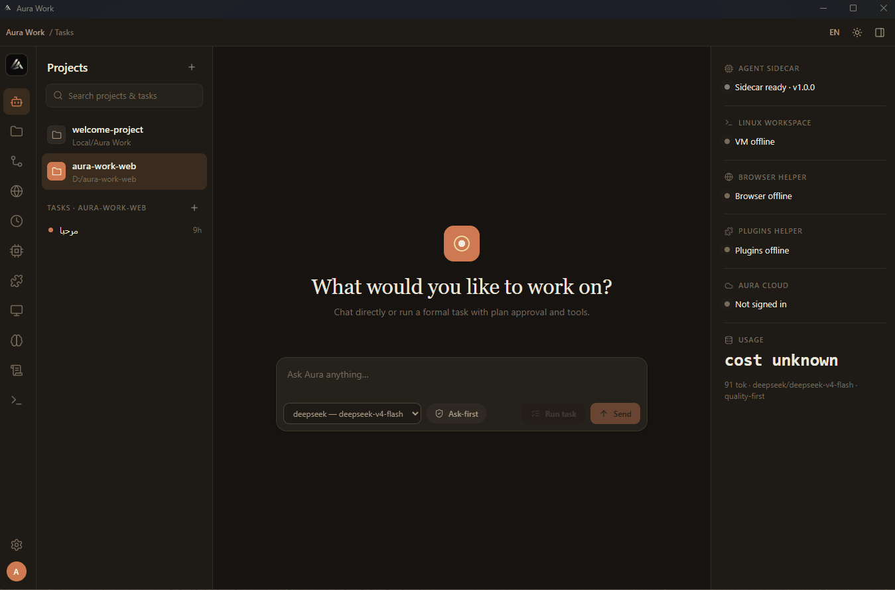

# Aura Work

[](LICENSE)
[](https://github.com/hbx12/aura-work/actions/workflows/ci.yml)

**Current status: `0.1.0-alpha.11`** — under active security hardening.

Open-source, multi-provider desktop AI agent platform — local-first, permission-gated, self-hostable.

## Build Marketplace extensions

Want to build an extension for Aura Work? Start here:

- **[Aura Marketplace Registry guide](./registry/README.md)** — the main public place for Skills, MCP connectors, Aura Plugins, supported languages, required files, and the GitHub approval flow.
- **[Marketplace submission guide](./docs/marketplace-submission.md)** — full submission format, validation rules, and maintainer review checklist.

Community extensions are submitted through GitHub pull requests and are published only after maintainer approval.

## Demo

<p align="center">
  
</p>

> **Alpha warning:** Do not use Aura Work for sensitive workspaces or production automation. VM isolation, signed installers, and several experimental features are incomplete or disabled by default.

## Download

Official desktop installers are published on the [GitHub Releases](https://github.com/hbx12/aura-work/releases/latest) page after an approved release. Installed copies receive optional signed update prompts when a newer version is available.

## Maintainer and contributions

Aura Work is maintained by **Habib (`hbx12`)**. Suggestions are reviewed actively, and useful ideas are turned into tracked implementation work with focused issues so contributors can pick up clear tasks without duplicating effort.

- [Contributors wanted: help build Aura Work alpha](https://github.com/hbx12/aura-work/issues/16)
- [Alpha release readiness epic](https://github.com/hbx12/aura-work/issues/30)
- [Computer Use accessibility-tree epic](https://github.com/hbx12/aura-work/issues/22)
- [Beginner-friendly issues](https://github.com/hbx12/aura-work/issues?q=is%3Aissue+is%3Aopen+label%3A%22good+first+issue%22)
- [Tasks needing help](https://github.com/hbx12/aura-work/issues?q=is%3Aissue+is%3Aopen+label%3A%22help+wanted%22)
- [Contribution guide](./CONTRIBUTING.md)
- [Marketplace Registry guide](./registry/README.md)

Please comment on an issue before starting work so effort is not duplicated.

## Alpha limitations

| Area | Status |
|------|--------|
| **Shell execution** | Host process fallback is **disabled by default**. WSL2 or a verified isolated backend is required. Dev override: `AURA_ALLOW_UNSAFE_HOST_EXECUTION=1` (development only). |
| **Computer use** | **Disabled by default.** Enable only for local dev: `AURA_ENABLE_EXPERIMENTAL_COMPUTER_USE=1`. |
| **VM image** | Bundled artifact may be a **development placeholder** until a signed production image ships. |
| **Signed releases** | Release pipeline requires minisign, SBOM, checksums, and installers — not claimed ready until published. |
| **Sidecar auth** | Local services require per-session internal Bearer tokens (localhost is not treated as sufficient). |

## Features (alpha)

- Multi-provider AI (OpenAI/ChatGPT Codex, Anthropic, Gemini, DeepSeek, Ollama) with routing
- Encrypted local vault — keys stored with OS-backed secure storage when available
- Task agent with file tools, Git, VM shell, browser, plugins/MCP
- 20 languages with RTL (Arabic, Persian)
- Integrated docs at [hbx12.github.io/aura-work](https://hbx12.github.io/aura-work) (when deployed)

## Quick start (development)

```powershell
npm install
npm run build:sidecars
npm start
```

Sidecars start automatically from the Tauri app with per-session internal auth tokens.

Manual sidecar development requires `AURA_SIDECAR_AUTH_TOKEN` (32+ chars) in the environment. See [docs/development.md](./docs/development.md).

## Build from source

```powershell
npm run build:sidecars
npm run stage:bundle
npm run build
cd apps\desktop
npm run tauri build
```

Installers are produced under `apps/desktop/src-tauri/target/release/bundle/` when the build succeeds.

## Privacy & security

- **No telemetry** by default
- API keys stored encrypted locally; **never** synced to Aura Cloud
- High-impact actions require explicit approval
- See [SECURITY.md](./SECURITY.md) for vulnerability reporting

## Documentation

- [docs/README.md](./docs/README.md) — feature index
- [registry/README.md](./registry/README.md) — Marketplace extension guide
- [docs/releases.md](./docs/releases.md) — approved GitHub Releases and optional signed updates
- [docs/github-publish.md](./docs/github-publish.md) — what goes on GitHub
- [CONTRIBUTING.md](./CONTRIBUTING.md) — development and translations
- [CHANGELOG.md](./CHANGELOG.md) — release history
- [ROADMAP.md](./ROADMAP.md) — direction after alpha

## Community

- [GitHub Discussions](https://github.com/hbx12/aura-work/discussions)
- [Code of Conduct](./CODE_OF_CONDUCT.md)

## License

See [LICENSE](./LICENSE), [NOTICE](./NOTICE), and [THIRD-PARTY-NOTICES](./THIRD-PARTY-NOTICES). Aura Work is licensed under the terms in `LICENSE`, including NOVIR Studio's additional branding and redistribution restriction.

## Clean-machine installer smoke test

For installed Windows build validation, see [docs/clean-machine-installer-smoke.md](./docs/clean-machine-installer-smoke.md).
